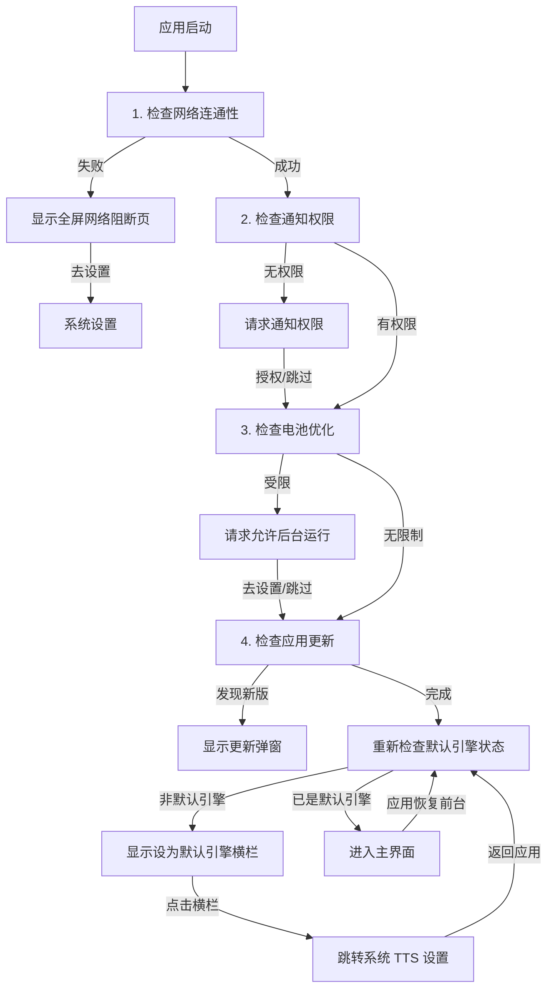

# Talkify 开发指南

本文档旨在为 Talkify 项目的开发者提供全方位的技术指导，涵盖架构设计、核心流程、代码规范及扩展指南。

## 目录

1. [项目概述](#1-项目概述)
2. [快速开始](#2-快速开始)
3. [技术架构](#3-技术架构)
4. [关键业务流程](#4-关键业务流程)
5. [配置存储方案](#5-配置存储方案)
6. [UI 与设计规范](#6-ui-与设计规范)
7. [扩展指南：添加新引擎](#7-扩展指南添加新引擎)
8. [发布与版本控制](#8-发布与版本控制)

---

## 1. 项目概述

Talkify 是一款基于 Android 的现代化 TTS (Text-to-Speech) 引擎应用。它不产生语音，而是作为**连接器**，将云端大模型（如通义千问、豆包）的高质量语音合成能力，通过 Android 标准 TTS 接口提供给系统和第三方阅读软件使用。

### 1.1 核心特性
- **云端驱动**：接入阿里云百炼（DashScope）和火山引擎（Volcengine）的流式 API。
- **架构解耦**：采用插件化架构，轻松扩展新的 TTS 服务商。
- **体验流畅**：完整的启动检查流程（网络/权限/电池优化），确保服务在后台稳定运行。
- **现代设计**：完全基于 Jetpack Compose 构建，遵循 Material 3 Expressive 设计规范。

---

## 2. 快速开始

### 2.1 环境要求
- **IDE**: Android Studio Ladybug | 2024.2.1+
- **JDK**: JDK 17
- **Android SDK**: API 36 (Android 16) / minSdk 30

### 2.2 常用命令

项目使用 Gradle 进行构建管理：

```bash
# Debug 构建（开发调试）
./gradlew assembleDebug

# Release 构建（正式包）
./gradlew assembleRelease

# 代码检查 (Lint)
./gradlew lint

# 运行单元测试
./gradlew test

# 清理构建缓存
./gradlew clean
```

### 2.3 依赖说明
关键依赖版本管理位于 `gradle/libs.versions.toml`：
- **UI**: Jetpack Compose BOM 2026.01.01
- **Network**: OkHttp 4.12.0
- **AI SDK**: DashScope SDK 2.22.5
- **Kotlin**: 2.3.0

---

## 3. 技术架构

Talkify 严格遵循 **MVVM (Model-View-ViewModel)** 架构模式，配合 **Clean Architecture** 的分层思想，实现逻辑与 UI 的分离。

### 3.1 核心目录结构

```text
app/src/main/java/com/github/lonepheasantwarrior/talkify/
├── MainActivity.kt                       // 【容器】无业务逻辑，仅承载 MainScreen
├── TalkifyApplication.kt                 // 【应用类】应用初始化、通知通道创建、全局异常处理
├── GlobalException.kt                    // 【异常处理】全局未捕获异常处理器
├── TalkifyCheckDataActivity.kt           // 【检查页】引擎数据完整性校验
├── TalkifyDownloadVoiceData.kt          // 【下载页】引擎音色数据下载管理
├── TalkifySampleTextActivity.kt          // 【样本文本】预置示例文本管理
├── util/                                 // 【工具层】通用工具类
│   └── TalkifyAudioPlayer.kt             // 音频播放工具（语音预览）
├── domain/                               // 【领域层】纯 Kotlin 业务接口与模型
│   ├── model/                            // 引擎配置、更新信息等数据模型
│   │   ├── BaseEngineConfig.kt           // 引擎配置基类
│   │   ├── ConfigItem.kt                 // 配置项模型
│   │   ├── EngineIds.kt                  // 引擎 ID 定义
│   │   ├── Qwen3TtsConfig.kt             // 通义千问 3 引擎配置
│   │   ├── SeedTts2Config.kt             // 豆包 Seed TTS 2 引擎配置
│   │   ├── TtsEngineRegistry.kt          // 引擎注册中心
│   │   ├── TtsModels.kt                  // TTS 相关数据模型
│   │   ├── UpdateCheckResult.kt          // 更新检查结果模型
│   │   └── UpdateInfo.kt                 // 更新信息模型
│   └── repository/                       // 仓储接口定义 (Repository Interfaces)
│       ├── AppConfigRepository.kt        // 应用配置仓储接口
│       ├── EngineConfigRepository.kt     // 引擎配置仓储接口
│       └── VoiceRepository.kt            // 音色仓储接口
├── infrastructure/                       // 【基础设施层】技术实现细节
│   ├── app/                              // 应用级设施
│   │   ├── notification/                 // 通知管理
│   │   │   ├── NotificationHelper.kt
│   │   │   ├── NotificationModels.kt
│   │   │   └── TalkifyNotificationHelper.kt
│   │   ├── permission/                   // 权限管理
│   │   │   ├── ConnectivityMonitor.kt
│   │   │   ├── NetworkConnectivityChecker.kt
│   │   │   └── PermissionChecker.kt
│   │   ├── power/                        // 电源管理
│   │   │   └── PowerOptimizationHelper.kt
│   │   └── repo/                         // 配置仓储实现
│   │       └── SharedPreferencesAppConfigRepository.kt
│   └── engine/                           // 引擎级设施
│       └── repo/                         // 引擎仓储实现
│           ├── Qwen3TtsConfigRepository.kt
│           ├── Qwen3TtsVoiceRepository.kt
│           ├── SeedTts2ConfigRepository.kt
│           └── SeedTts2VoiceRepository.kt
├── service/                              // 【服务层】Android Service 实现
│   ├── TalkifyTtsService.kt              // 系统 TTS 服务入口
│   ├── TalkifyTtsDemoService.kt          // Demo 预览服务
│   ├── TtsErrorCode.kt                   // 错误码定义
│   ├── TtsErrorHelper.kt                 // 错误处理工具
│   ├── TtsLogger.kt                      // 日志工具
│   ├── engine/                           // TTS 引擎统一抽象
│   │   ├── AbstractTtsEngine.kt          // 引擎抽象基类
│   │   ├── TtsEngineApi.kt               // 引擎接口定义
│   │   ├── TtsEngineFactory.kt           // 引擎工厂
│   │   ├── AudioConfig.kt                // 音频配置
│   │   └── impl/                         // 具体引擎实现
│   │       ├── Qwen3TtsEngine.kt
│   │       └── SeedTts2Engine.kt
└── ui/                                   // 【表现层】Jetpack Compose UI
    ├── components/                       // 通用 UI 组件
    │   ├── BatteryOptimizationDialog.kt
    │   ├── ConfigBottomSheet.kt
    │   ├── ConfigEditor.kt
    │   ├── EngineSelector.kt
    │   ├── MarkdownText.kt
    │   ├── NetworkBlockedDialog.kt
    │   ├── NotificationPermissionDialog.kt
    │   ├── PermissionDialog.kt
    │   ├── UpdateDialog.kt
    │   └── VoicePreview.kt
    ├── screens/                           // 页面级 Composable
    │   ├── MainScreen.kt                  // 主界面（含默认引擎提示横栏）
    │   └── DefaultEngineBanner.kt          // 默认引擎提示横栏组件
    ├── viewmodel/                         // 状态管理
    │   └── MainViewModel.kt
    └── theme/                            // Material 3 主题定义
        ├── Color.kt
        ├── Theme.kt
        └── Type.kt
```

### 3.2 架构设计详解

#### 3.2.1 启动流程架构 (MVVM)
应用启动涉及多个复杂的异步检查步骤。为了避免 `MainActivity` 代码膨胀和弹窗冲突，我们采用 **State Machine（状态机）** 模式：

- **ViewModel (`MainViewModel`)**: 维护单一真实数据源 `uiState` (`StartupState`)。它按顺序调度检查任务，控制流程流转。
- **View (`MainScreen`)**: 响应式 UI。根据 `uiState` 的变化（如 `CheckingNetwork`, `RequestingBattery`）动态切换显示的弹窗或内容。
- **Activity (`MainActivity`)**: 极简容器，不处理任何逻辑。

#### 3.2.2 TTS 引擎架构 (Plugin-based)
引擎模块采用接口隔离设计，确保新增引擎不影响现有代码：
- **`TtsEngineApi`**: 定义标准行为（合成、停止、销毁）。
- **`AbstractTtsEngine`**: 提供通用实现（日志、状态检查）。
- **`TtsEngineRegistry`**: 引擎注册中心，管理所有可用引擎。
- **`TtsEngineFactory`**: 引擎实例工厂，根据 ID 创建对应引擎。

#### 3.2.3 应用初始化架构
- **`TalkifyApplication`**: 应用入口类，负责：
  - 初始化 `TalkifyAppHolder` 全局上下文
  - 注册 `TalkifyExceptionHandler` 全局异常处理器
  - 预创建所有通知通道（`ensureNotificationChannel`）

---

## 4. 关键业务流程

### 4.1 应用启动自检流程

应用冷启动时，`MainViewModel` 会严格按照以下顺序执行串行检查。任何一步受阻都会暂停流程，直到用户解决或授权。



### 4.2 权限管理策略

为了保障 TTS 服务的核心体验，我们对关键权限采取**持续引导**策略：

1.  **允许后台运行 (忽略电池优化)**
    *   **必要性**：TTS 服务通常在后台运行，若被系统电池优化杀掉进程或切断网络，会导致朗读中断。
    *   **策略**：应用不保存"以后再说"的状态。只要检测到未忽略电池优化，**每次启动都会提示**。
    *   **交互**：点击"去设置"会尝试直接弹窗，失败则跳转系统列表页。

2.  **通知权限**
    *   **必要性**：用于在前台服务运行时显示"正在朗读"通知，以及错误提示。
    *   **策略**：同上，未授权则每次启动均提示。

### 4.3 语音合成流程
1.  第三方 App 调用 Android `TextToSpeech` API。
2.  `TalkifyTtsService` 接收请求，解析文本。
3.  委托给当前选中的 `TtsEngine` 实现类（如 `Qwen3TtsEngine`）。
4.  引擎通过网络流式请求音频数据。
5.  数据通过 `SynthesisCallback` 写入 Android 音频管道播放。

### 4.4 音频播放机制
- **WakeLock**: 防止合成过程中设备进入休眠状态
- **WifiLock**: 确保 WiFi 保持高性能模式，保障流式传输稳定性
- **前台服务**: 使用 `START_STICKY` 机制确保服务被系统杀死后能够自动重启

### 4.5 默认引擎检测
为了提供更好的用户体验，应用会在启动时检查 Talkify 是否已设置为系统的默认 TTS 引擎：

- **检测时机**：
  - 应用启动完成时
  - 应用从后台恢复到前台时
- **检测逻辑**：通过 `TextToSpeech.defaultEngine` 获取当前系统默认引擎，与 Talkify 的包名进行比较
- **提示展示**：若非默认引擎，显示 `DefaultEngineBanner` 提示横栏
- **交互方式**：点击横栏任意位置跳转到系统 TTS 设置页面
- **状态刷新**：用户设置完成后返回应用时，自动重新检测并更新横栏显示状态

---

## 5. 配置存储方案

应用采用轻量级的 `SharedPreferences` 进行配置持久化，统一通过 `SharedPreferencesAppConfigRepository` 管理：

1.  **应用级配置 (`AppConfigRepository`)**
    - 存储：统一的 SharedPreferences 文件
    - 内容：当前选中的引擎 ID
    
2.  **引擎级配置 (`EngineConfigRepository`)**
    - 存储：各引擎独立的配置键值对
    - 内容：各引擎独立的 API Key、Voice ID、音色配置等。
    - 扩展性：每个引擎配置类继承自 `BaseEngineConfig`，实现配置隔离。

---

## 6. UI 与设计规范

项目全面拥抱 **Jetpack Compose** 和 **Material 3 Expressive** 风格。

### 6.1 弹窗规范
为了保持系统一致性和良好的阅读体验：
- **标题**：简明扼要，使用 `HeadlineSmall` 样式。
- **正文**：说明性文字必须使用 **左对齐 (`TextAlign.Start`)**，避免大段文字居中造成的阅读困难。
- **操作**：主要操作（如"去设置"）在右侧，次要操作（如"以后再说"）在左侧。

### 6.2 资源管理
- **多语言**：所有文本提取至 `res/values/strings.xml`，严禁在代码中硬编码字符串。
- **声音数据**：各引擎支持的音色列表定义在 `res/values/xxx-voices.xml` 中，便于独立更新。
- **示例文本**：预置朗读样本文本定义在 `res/values/demo_texts.xml` 中。

### 6.3 主题规范
- **颜色**：遵循 Material 3 色彩系统，使用 `Color.kt` 定义应用级配色。
- **字体**：使用 `Type.kt` 统一定义字体样式和排版规范。

---

## 7. 扩展指南：添加新引擎

若需接入新的 TTS 服务商（例如 Azure），请遵循以下步骤：

1.  **定义配置**：在 `domain/model` 下创建 `AzureConfig`，继承 `BaseEngineConfig`。
2.  **实现引擎**：在 `service/engine/impl` 下创建 `AzureTtsEngine`，继承 `AbstractTtsEngine`，实现合成逻辑。
3.  **实现仓储**：在 `infrastructure/engine/repo` 下创建对应的 Voice 和 Config 仓储实现。
4.  **注册引擎**：
    - 在 `TtsEngineRegistry` 中添加引擎元数据。
    - 在 `TtsEngineFactory` 中注册引擎实例创建逻辑。
    - 在 `EngineSelector` UI 中添加分支支持（如果 UI 需要特殊处理）。
5.  **添加音色资源**：在 `res/values` 下创建 `azure-voices.xml` 定义支持的音色列表。
6.  **编写测试**：在 `app/src/test/java` 下编写单元测试验证引擎功能。

---

## 8. 发布与版本控制

### 8.1 版本号规范
- **versionName**: `Major.Minor.Patch` (例如 1.0.15)
- **versionCode**: 单调递增整数 (例如 17)

### 8.2 发布检查清单
- [ ] 确保 `gradle/libs.versions.toml` 中的库版本为最新稳定版。
- [ ] 运行 `lint` 检查潜在问题。
- [ ] 运行 `test` 确保单元测试通过。
- [ ] 验证启动全流程（全新安装、覆盖安装）。
- [ ] 验证所有引擎的 API Key 配置能否正常保存和读取。

---

## 9. 示例代码与测试

### 9.1 示例代码
项目提供以下示例代码供参考：
- `examples/AudioParameters.java`: 音频参数配置示例
- `examples/ProcessingReal‑timePlayback.java`: 实时播放处理示例
- `examples/StreamingOutputRequest.java`: 流式输出请求示例
- `examples/tts_http_demo.py`: Python HTTP 流式合成示例

### 9.2 测试覆盖
- **单元测试**: `app/src/test/java/` 目录
  - `ExampleUnitTest.kt`: 基础单元测试
  - `TtsErrorCodeTest.kt`: 错误码测试
- **仪表盘测试**: `app/src/androidTest/java/` 目录
  - `ExampleInstrumentedTest.kt`: 仪器化测试

---

*文档最后更新时间: 2026年02月04日*
*对应应用版本: 1.0.16*
