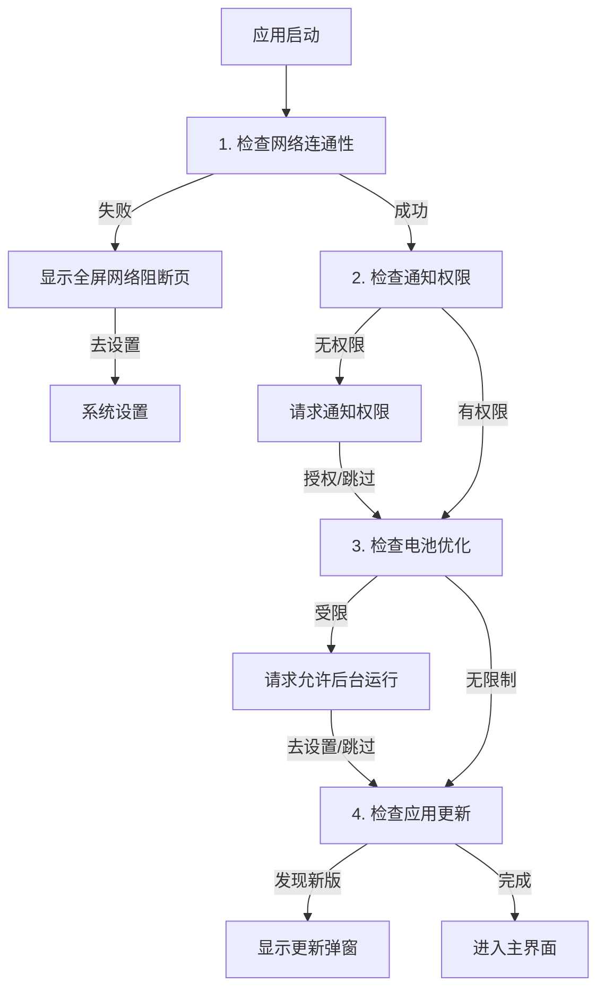

# Talkify 开发指南

本文档旨在为 Talkify 项目的开发者提供全方位的技术指导，涵盖架构设计、核心流程、代码规范及扩展指南。

## 目录

1. [项目概述](#1-项目概述)
2. [快速开始](#2-快速开始)
3. [技术架构](#3-技术架构)
4. [关键业务流程](#4-关键业务流程)
5. [配置存储方案](#5-配置存储方案)
6. [UI 与设计规范](#6-ui-与设计规范)
7. [扩展指南：添加新引擎](#7-扩展指南添加新引擎)
8. [发布与版本控制](#8-发布与版本控制)

---

## 1. 项目概述

Talkify 是一款基于 Android 的现代化 TTS (Text-to-Speech) 引擎应用。它不产生语音，而是作为**连接器**，将云端大模型（如通义千问、豆包）的高质量语音合成能力，通过 Android 标准 TTS 接口提供给系统和第三方阅读软件使用。

### 1.1 核心特性
- **云端驱动**：接入阿里云百炼（DashScope）和火山引擎（Volcengine）的流式 API。
- **架构解耦**：采用插件化架构，轻松扩展新的 TTS 服务商。
- **体验流畅**：完整的启动检查流程（网络/权限/电池优化），确保服务在后台稳定运行。
- **现代设计**：完全基于 Jetpack Compose 构建，遵循 Material 3 Expressive 设计规范。

---

## 2. 快速开始

### 2.1 环境要求
- **IDE**: Android Studio Ladybug | 2024.2.1+
- **JDK**: JDK 17
- **Android SDK**: API 36 (Android 16) / minSdk 30

### 2.2 常用命令

项目使用 Gradle 进行构建管理：

```bash
# Debug 构建（开发调试）
./gradlew assembleDebug

# Release 构建（正式包）
./gradlew assembleRelease

# 代码检查 (Lint)
./gradlew lint

# 清理构建缓存
./gradlew clean
```

### 2.3 依赖说明
关键依赖版本管理位于 `gradle/libs.versions.toml`：
- **UI**: Jetpack Compose BOM 2026.01.01
- **Network**: OkHttp 4.12.0
- **AI SDK**: DashScope SDK 2.22.5

---

## 3. 技术架构

Talkify 严格遵循 **MVVM (Model-View-ViewModel)** 架构模式，配合 **Clean Architecture** 的分层思想，实现逻辑与 UI 的分离。

### 3.1 核心目录结构

```text
app/src/main/java/com/github/lonepheasantwarrior/talkify/
├── MainActivity.kt               // 【容器】无业务逻辑，仅承载 MainScreen
├── domain/                       // 【领域层】纯 Kotlin 业务接口与模型
│   ├── model/                    // 引擎配置、更新信息等数据模型
│   └── repository/               // 仓储接口定义 (Repository Interfaces)
├── infrastructure/               // 【基础设施层】技术实现细节
│   ├── app/                      // 应用级设施 (权限、电源、网络、更新)
│   └── engine/                   // 引擎级设施 (API 调用、数据存储实现)
├── service/                      // 【服务层】Android Service 实现
│   ├── TalkifyTtsService.kt      // 系统 TTS 服务入口
│   ├── engine/                   // TTS 引擎统一抽象 (AbstractTtsEngine)
│   └── impl/                     // 具体引擎实现 (Qwen, SeedTts)
└── ui/                           // 【表现层】Jetpack Compose UI
    ├── components/               // 通用 UI 组件 (Dialogs, Selectors)
    ├── screens/                  // 页面级 Composable (MainScreen)
    ├── viewmodel/                // 状态管理 (StartupViewModel)
    └── theme/                    // Material 3 主题定义
```

### 3.2 架构设计详解

#### 3.2.1 启动流程架构 (MVVM)
应用启动涉及多个复杂的异步检查步骤。为了避免 `MainActivity` 代码膨胀和弹窗冲突，我们采用 **State Machine（状态机）** 模式：

- **ViewModel (`StartupViewModel`)**: 维护单一真实数据源 `uiState` (`StartupState`)。它按顺序调度检查任务，控制流程流转。
- **View (`MainScreen`)**: 响应式 UI。根据 `uiState` 的变化（如 `CheckingNetwork`, `RequestingBattery`）动态切换显示的弹窗或内容。
- **Activity (`MainActivity`)**: 极简容器，不处理任何逻辑。

#### 3.2.2 TTS 引擎架构 (Plugin-based)
引擎模块采用接口隔离设计，确保新增引擎不影响现有代码：
- **`TtsEngineApi`**: 定义标准行为（合成、停止、销毁）。
- **`AbstractTtsEngine`**: 提供通用实现（日志、状态检查）。
- **`TtsEngineRegistry`**: 引擎注册中心，管理所有可用引擎。

---

## 4. 关键业务流程

### 4.1 应用启动自检流程

应用冷启动时，`StartupViewModel` 会严格按照以下顺序执行串行检查。任何一步受阻都会暂停流程，直到用户解决或授权。



### 4.2 权限管理策略

为了保障 TTS 服务的核心体验，我们对关键权限采取**持续引导**策略：

1.  **允许后台运行 (忽略电池优化)**
    *   **必要性**：TTS 服务通常在后台运行，若被系统电池优化杀掉进程或切断网络，会导致朗读中断。
    *   **策略**：应用不保存“以后再说”的状态。只要检测到未忽略电池优化，**每次启动都会提示**。
    *   **交互**：点击“去设置”会尝试直接弹窗，失败则跳转系统列表页。

2.  **通知权限**
    *   **必要性**：用于在前台服务运行时显示“正在朗读”通知，以及错误提示。
    *   **策略**：同上，未授权则每次启动均提示。

### 4.3 语音合成流程
1.  第三方 App 调用 Android `TextToSpeech` API。
2.  `TalkifyTtsService` 接收请求，解析文本。
3.  委托给当前选中的 `TtsEngine` 实现类（如 `Qwen3TtsEngine`）。
4.  引擎通过网络流式请求音频数据。
5.  数据通过 `TtsStreamHandler` 写入 Android 音频管道播放。

---

## 5. 配置存储方案

应用采用轻量级的 `SharedPreferences` 进行配置持久化，分为两个维度：

1.  **应用级配置 (`AppConfigRepository`)**
    - 存储：`talkify_app_config.xml`
    - 内容：当前选中的引擎 ID。
    
2.  **引擎级配置 (`EngineConfigRepository`)**
    - 存储：`talkify_engine_configs.xml`
    - 内容：各引擎独立的 API Key、Voice ID、音色配置等。
    - 扩展性：每个引擎配置类继承自 `BaseEngineConfig`，实现配置隔离。

---

## 6. UI 与设计规范

项目全面拥抱 **Jetpack Compose** 和 **Material 3 Expressive** 风格。

### 6.1 弹窗规范
为了保持系统一致性和良好的阅读体验：
- **标题**：简明扼要，使用 `HeadlineSmall` 样式。
- **正文**：说明性文字必须使用 **左对齐 (`TextAlign.Start`)**，避免大段文字居中造成的阅读困难。
- **操作**：主要操作（如“去设置”）在右侧，次要操作（如“以后再说”）在左侧。

### 6.2 资源管理
- **多语言**：所有文本提取至 `res/values/strings.xml`，严禁在代码中硬编码字符串。
- **声音数据**：各引擎支持的音色列表定义在 `res/values/xxx-voices.xml` 中，便于独立更新。

---

## 7. 扩展指南：添加新引擎

若需接入新的 TTS 服务商（例如 Azure），请遵循以下步骤：

1.  **定义配置**：在 `domain/model` 下创建 `AzureConfig`，继承 `BaseEngineConfig`。
2.  **实现引擎**：在 `service/engine/impl` 下创建 `AzureTtsEngine`，继承 `AbstractTtsEngine`，实现合成逻辑。
3.  **实现仓储**：在 `infrastructure/engine/repo` 下实现对应的 Voice 和 Config 仓储。
4.  **注册引擎**：
    - 在 `TtsEngineRegistry` 中添加引擎元数据。
    - 在 `TtsEngineFactory` 中注册引擎实例创建逻辑。
    - 在 `EngineSelector` UI 中添加分支支持（如果 UI 需要特殊处理）。

---

## 8. 发布与版本控制

### 8.1 版本号规范
- **versionName**: `Major.Minor.Patch` (例如 1.0.13)
- **versionCode**: 单调递增整数 (例如 15)

### 8.2 发布检查清单
- [ ] 确保 `gradle/libs.versions.toml` 中的库版本为最新稳定版。
- [ ] 运行 `lint` 检查潜在问题。
- [ ] 验证启动全流程（全新安装、覆盖安装）。
- [ ] 验证所有引擎的 API Key 配置能否正常保存和读取。

---

*文档最后更新时间: 2026年02月02日*
*对应应用版本: 1.0.13*